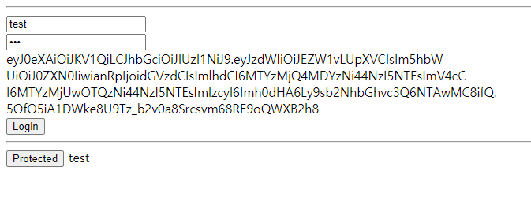

# flask-jwt-demo
https://jwt.io/

## 환경
```
python 3.8 

pip install Flask
pip install pyjwt
https://pyjwt.readthedocs.io/en/latest/
```

## 테스트
```shell script
1. Flask app 실행
python app.py

2. 브라우저 접속
localhost:5000

3. 로그인 
userId와 password 전송 후 
response jwt 확인

4. protected 페이지 접속

```


